<style>span{color:#ff0a74; font-weight:bold;}</style>
# Лабораторная работа №5: Запуск сайта в контейнере
## Цель моей работы
 Я должен научиться подготавливать образ контейнера для запуска веб-сайта на базе Apache HTTP Server + PHP (mod_php) + MariaDB.

## МОЁ ЗАДАНИЕ
1. Создать Dockerfile для сборки образа контейнера, который будет содержать веб-сайт на базе Apache HTTP Server + PHP (mod_php) + MariaDB. База данных MariaDB должна храниться в монтируемом томе. Сервер должен быть доступен по порту 8000.

2. Установить сайт WordPress. Проверить работоспособность сайта.

## Выполнение
Я Создал репозиторий containers05 и скопировал его себе на компьютер.

### извлечение конфигурационных файлов apache2, php, mariadb из контейнера

Я Создал в папке <span>containers05</span> папку **files**, а также

- папку `files->apache2` - для файлов конфигурации apache2;
- папку `files->php` - для файлов конфигурации php;
- папку `files->mariadb` - для файлов конфигурации mariadb.

```Dockerfile
# create from debian image
FROM debian:latest

# install apache2, php, mod_php for apache2, php-mysql and mariadb
RUN apt-get update && \
    apt-get install -y apache2 php libapache2-mod-php php-mysql mariadb-server && \
    apt-get clean
```

`FROM debian:latest` -Берёт базовый образ - Linux (Debian)
latest = последняя версия

`RUN` Выполняет команды внутри контейнера при сборке.

`apt-get update`
Обновляет список пакетов
Без этого нельзя нормально ставить программы


`apt-get install -y ...`

Устанавливает пакеты:

- apache2 — веб-сервер
- php — язык PHP
- libapache2-mod-php — чтобы Apache понимал PHP
php-mysql — работа PHP с MySQL
- mariadb-server — база данных (аналог MySQL)

`apt-get clean`
Очищает кэш пакетов
Делает образ меньше по размеру
после установки он уже не нужен.
Удаляет:скачанные .deb файлы, временные данные

### Построю образ контейнера с именем apache2-php-mariadb.

```Dockerfile
dockerbuild -t apache2-php-mariadb .
```

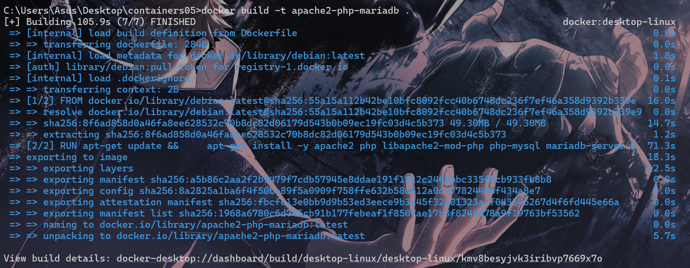
### Создаю контейнер apache2-php-mariadb 
из образа apache2-php-mariadb и запускаю его в фоновом режиме с командой запуска bash.

```bash
docker run -dit --name apache2-php-mariadb apache2-php-mariadb bash
```

--name - имя контейнера.

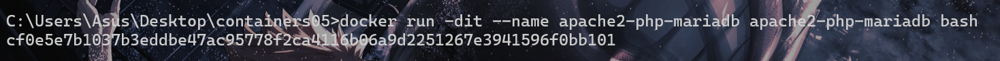


## Скопировали из контейнера файлы конфигурации apache2,php, mariadb в папку files/ на компьютере.

### Для этого, в контексте проекта, выполняю следующие команды:
```bash
docker cp apache2-php-mariadb:/etc/apache2/sites-available/000-default.conf files/apache2/
docker cp apache2-php-mariadb:/etc/apache2/apache2.conf files/apache2/
docker cp apache2-php-mariadb:/etc/php/8.4/apache2/php.ini files/php/
docker cp apache2-php-mariadb:/etc/mysql/mariadb.conf.d/50-server.cnf files/mariadb/
```

PHP версия у нас - ***8.4*** (исправяем с 8.2)

Как я это узнал?  

```bash
docker exec -it apache2-php-mariadb bash
find / -name php.ini 2>/dev/null
```
>2> /dev/null - игнорировать ошибки

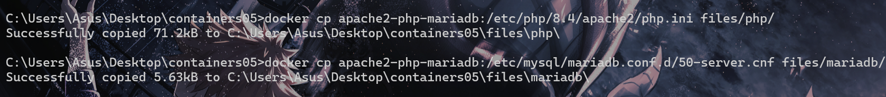

После выполнения команд в папке <span>files/</span> должны появиться файлы конфигурации **apache2, php, mariadb.**

- Проверяю их наличие.

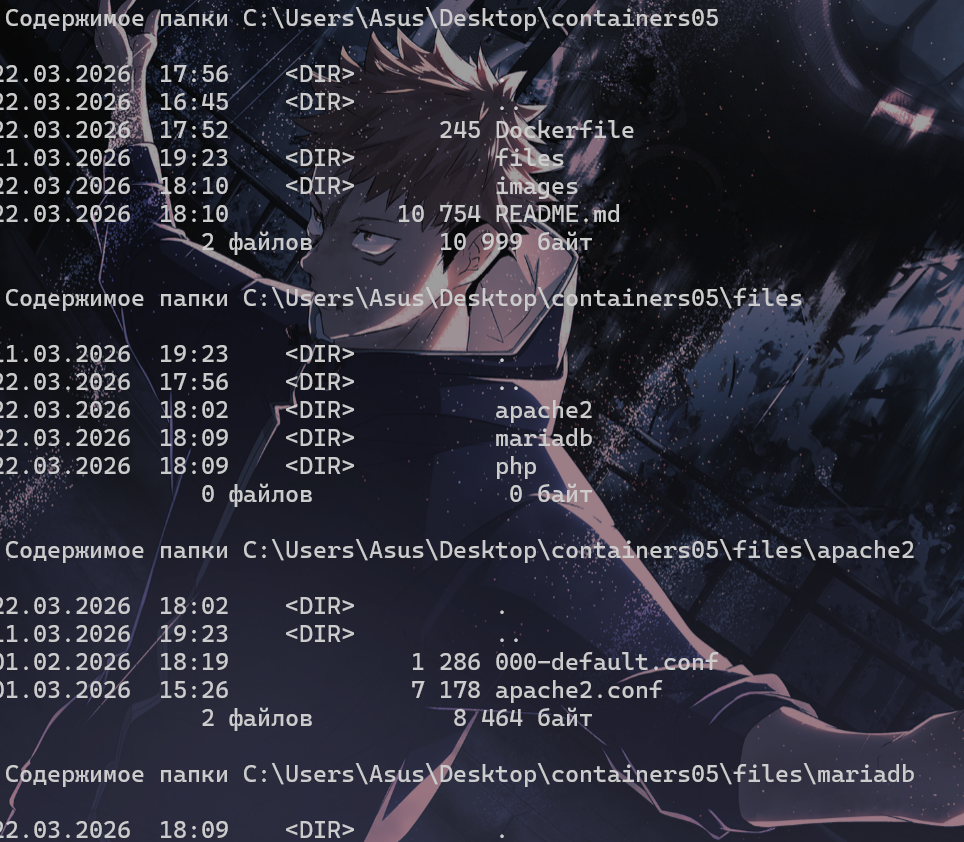

> Останавливаю и удаляю контейнер apache2-php-mariadb.

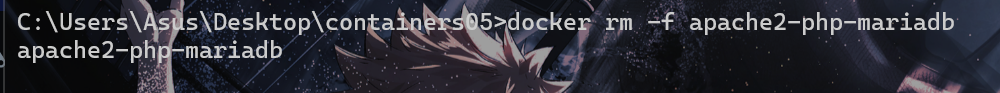

-f = -force (автоматически закрывает и удаляет контейнер)

## Настройка конфигурационных файлов
### Конфигурационный файл apache2
Откройте файл files/apache2/000-default.conf, найдите строку #ServerName www.example.com и замените её на ServerName localhost.

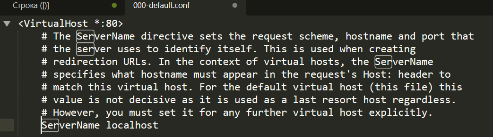

Найдите строку ServerAdmin webmaster@localhost и замените в ней почтовый адрес на свой.

После строки **DocumentRoot /var/www/html** добавьте следующие строки:
```js
DirectoryIndex index.php index.html
```
Сохраняю файл и закрываю.

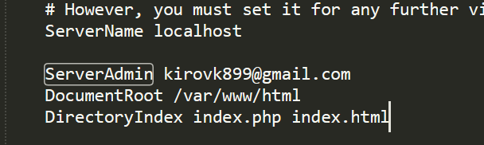

В конце файла <span>files/apache2/apache2.conf</span> добавлю следующую строку:

```js
ServerName localhost
```

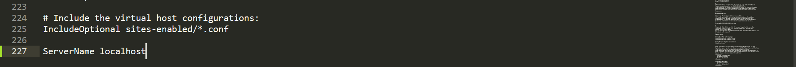

## Конфигурационный файл php
Открываю files/php/php.ini, и нахожу строку ;
error_log = php_errors.log и замените её на error_log = /var/log/php_errors.log.

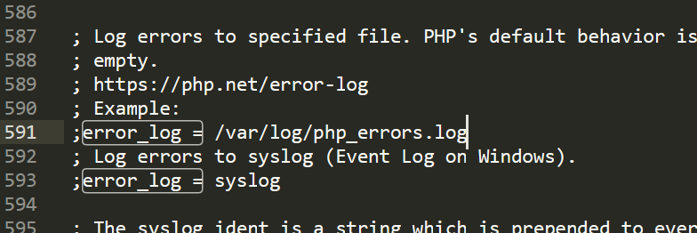

Настроил параметры **memory_limit, upload_max_filesize, post_max_size и max_execution_time** следующим образом:

- memory_limit = 128M
- upload_max_filesize = 128M
- post_max_size = 128M
- max_execution_time = 120
Сохраняю файл и закрываю.

## Конфигурационный файл mariadb
Открыл файл <span>files/mariadb/50-server.cnf</span>, нашел строку #log_error = /var/log/mysql/error.log и раскомментировал её.

Сохранил файл и закрыл.

## Создание скрипта запуска
Создал в папке files папку supervisor и файл supervisord.conf со следующим содержимым:
```js 
[supervisord]
nodaemon=true
logfile=/dev/null
user=root

# apache2
[program:apache2]
command=/usr/sbin/apache2ctl -D FOREGROUND
autostart=true
autorestart=true
startretries=3
stderr_logfile=/proc/self/fd/2
user=root

# mariadb
[program:mariadb]
command=/usr/sbin/mariadbd --user=mysql
autostart=true
autorestart=true
startretries=3
stderr_logfile=/proc/self/fd/2
user=mysql
```
# Создание Dockerfile
Открыл файл <span>Dockerfile</span> и добавил в него следующие строки:

после инструкции **FROM ...** добавил монтирование томов:
```docker
# mount volume for mysql data
VOLUME /var/lib/mysql

# mount volume for logs
VOLUME /var/log
```

/var/lib/mysql — это папка, где MariaDB хранит свои базы данных.

/var/log — папка для логов сервера (Apache, PHP, MariaDB).


в инструкции RUN ... добавьте установку пакета supervisor.

```docker
RUN apt-get update && \
    apt-get install -y apache2 php libapache2-mod-php php-mysql mariadb-server supervisor && \
    apt-get clean && rm -rf /var/lib/apt/lists/*
```

    Supervisor — это пакет, который позволяет управлять несколькими процессами внутри контейнера.
    После установки можно запускать его с моим конфигом supervisord.conf.

    rm -rf /var/lib/apt/lists/* — убирает кеш apt, чтобы образ был меньше.

Теперь мой контейнер сможет одновременно управлять **Apache, MariaDB и любыми другими процессами через Supervisor**.

после инструкции RUN ... добавьте копирование и распаковку сайта WordPress:
```docker
# add wordpress files to /var/www/html
ADD https://wordpress.org/latest.tar.gz /var/www/html/
```

В ***Dockerfile*** директива ***ADD*** используется для копирования файлов в контейнер, а также может скачивать файлы по URL.

В отличие от COPY, ADD умеет:

- Скачивать файлы по URL.
- Распаковывать архивы .tar, если путь назначения


## После копирования файлов WordPress
 добавил копирование конфигурационных файлов **apache2, php, mariadb**, а также скрипта запуска:
```docker
# copy the configuration file for apache2 from files/ directory
COPY files/apache2/000-default.conf /etc/apache2/sites-available/000-default.conf
COPY files/apache2/apache2.conf /etc/apache2/apache2.conf

# copy the configuration file for php from files/ directory
COPY files/php/php.ini /etc/php/8.4/apache2/php.ini

# copy the configuration file for mysql from files/ directory
COPY files/mariadb/50-server.cnf /etc/mysql/mariadb.conf.d/50-server.cnf

# copy the supervisor configuration file
COPY files/supervisor/supervisord.conf /etc/supervisor/supervisord.conf
```
для функционирования ***mariadb*** создаём папку /***var/run/mysqld*** и устанавливаем права на неё:

```docker
# create mysql socket directory
RUN mkdir /var/run/mysqld && chown mysql:mysql /var/run/mysqld
```

`mkdir /var/run/mysqld`- Создаёт папку `/var/run/mysqld`.
В ней **MariaDB** будет хранить файл **сокета** (.sock) для соединений с **MySQL**.
Без этой папки сервер может не запуститься, потому что некуда писать сокет.

>Сокет — это способ, с помощью которого программы на компьютере обмениваются данными друг с другом. Он используется для связи между сервером базы данных и клиентом на той же машине, без использования сети.

`chown mysql:mysql /var/run/mysqld`
Меняет владельца и группу папки на пользователя mysql.
MariaDB внутри контейнера обычно запускается под пользователем mysql, и ему нужен доступ на запись в эту папку.


откройте порт 80.
```dockerfile
EXPOSE 80
```
>[!NOTE]
>
>чтобы MariaDB была доступна снаружи контейнера, то порт 3306 нужно явно пробросить.

добавьте команду запуска supervisord:
```Docker
# start supervisor
CMD ["/usr/bin/supervisord", "-n", "-c", "/etc/supervisor/conf.d/supervisord.conf"]
```

`-n`

Запуск в foreground (на переднем плане),чтобы контейнер не завершился сразу. 

`-c /etc/supervisor/conf.d/supervisord.conf`
/conf.d/  - лишнее, убираем, мы копируем в :

Указывает, какой конфигурационный файл использовать для запуска процессов.
В этом файле перечислены все сервисы, которые Supervisor должен запускать.

## Собираю образ контейнера с именем <span>apache2-php-mariadb</span>


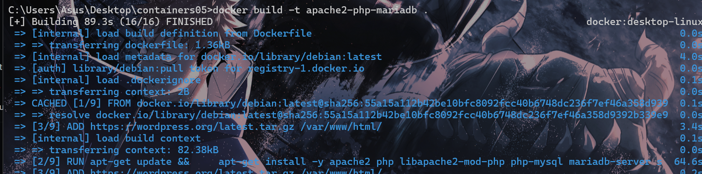
### Запуск контейнера
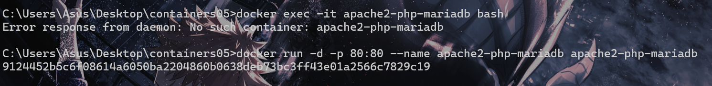

Проверяю наличие сайта WordPress в папке /var/www/html/. В папке я ображужил архив, и index.html.  

```bash 
docker exec -it apache2-php-mariadb bash
ls /var/www/html
```
Распаковывею его :

```bash
tar -xvzf latest.tar.gz --strip-components=1
```

**tar** — это утилита для работы с архивами `.tar`, `.tar.gz`, `.tgz` и т.д.
Она умеет **создавать, распаковывать и просматривать** такие архивы

 Проверяю изменения конфигурационного файла **apache2**.

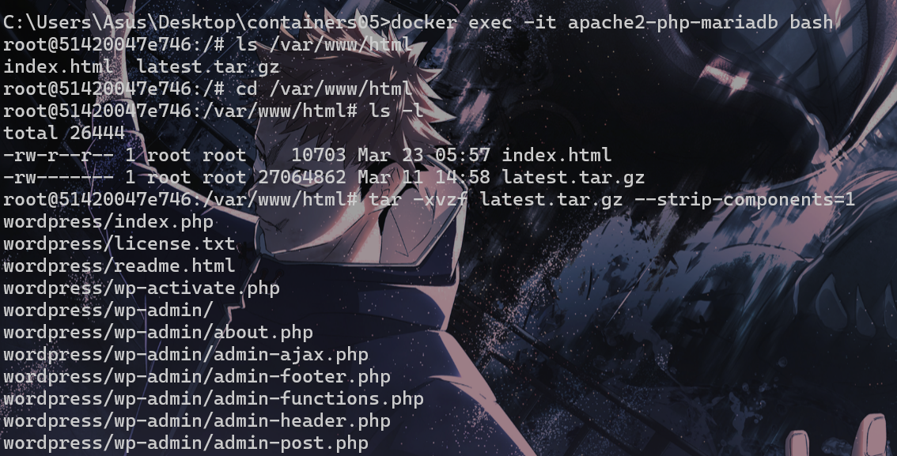
### После распаковки
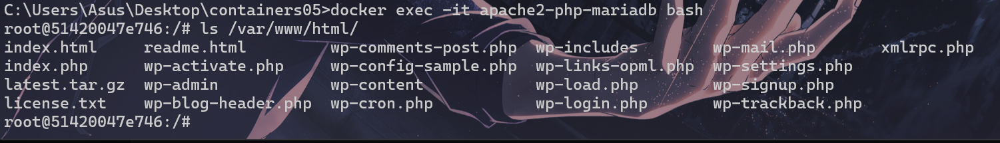

## Файл конфигурации стал с такими же параметрами, как мы прописали в files/apache2/000-default.conf

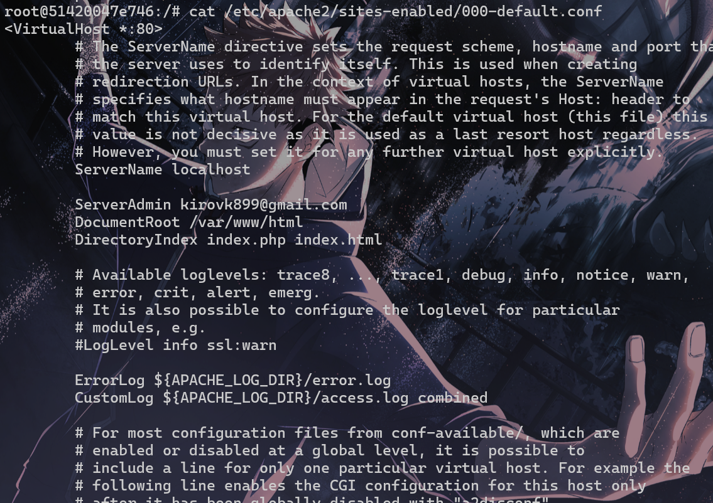
## Создание базы данных и пользователя
Создаю базу данных wordpress и пользователя wordpress с паролем wordpress в контейнере apache2-php-mariadb.

 Для этого, в контейнере apache2-php-mariadb, выполняю команды:

```sql
CREATE DATABASE wordpress;
CREATE USER 'wordpress'@'localhost' IDENTIFIED BY 'wordpress';
GRANT ALL PRIVILEGES ON wordpress.* TO 'wordpress'@'localhost';
FLUSH PRIVILEGES;
EXIT;
```

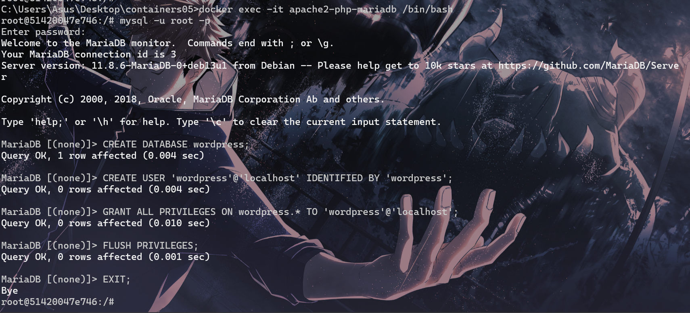

```bash
docker exec -it apache2-php-mariadb /bin/bash
mysql -u root -p
```

## Создание файла конфигурации WordPress
Открыл в браузере сайт WordPress по адресу *http://localhost/.* Указываю параметры подключения к базе данных:

- имя базы данных: wordpress;
- имя пользователя: wordpress;
- пароль: wordpress;
- адрес сервера базы данных: localhost;
- префикс таблиц: wp_.

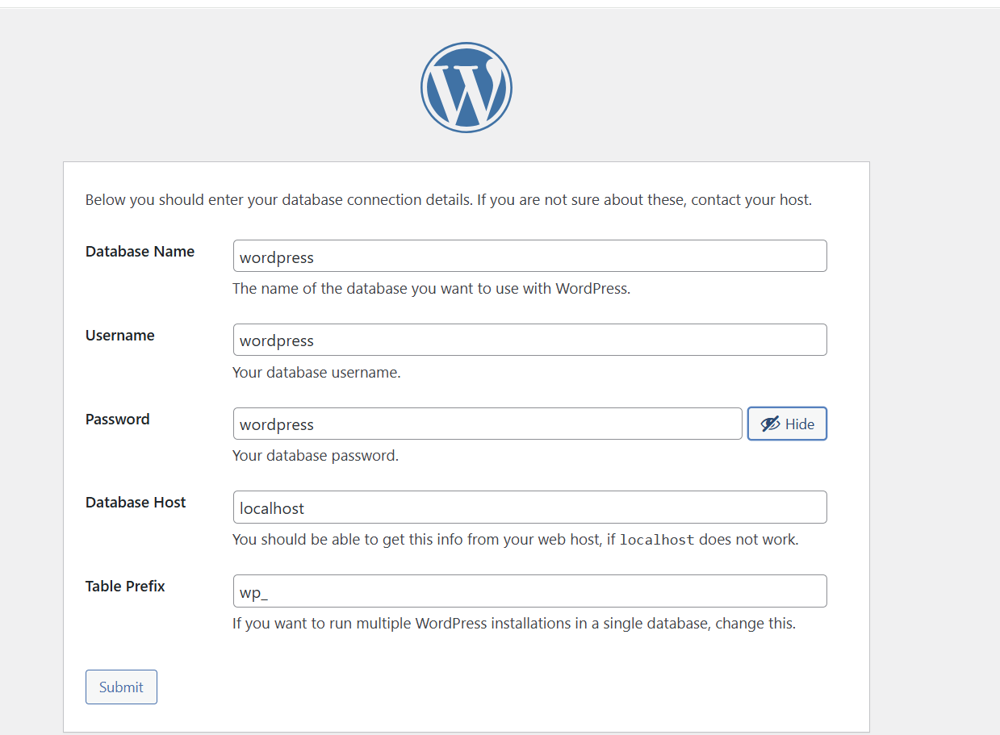

## Теперь вы знаете мой пароль😒

Скопировал содержимое файла конфигурации в файл `files/wp-config.php` на компьютере. чтобы потом его копировать в контейнер.

Добавляю файл конфигурации **WordPress** в **Dockerfile**
Добавляю в файл Dockerfile следующие строки:
```dockerfile
# copy the configuration file for wordpress from files/ directory
COPY files/wp-config.php /var/www/html/wordpress/wp-config.php
```
# Запуск и тестирование
Пересобираю образ контейнера с именем **apache2-php-mariadb** и запускаю контейнер  из образа. Про веряю работоспособность сайта WordPress.

## Образ пересобрался и это круто
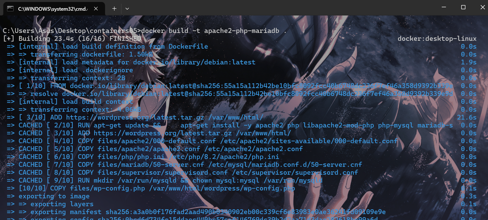

### Не забуду остановить и удалить старый контейнер
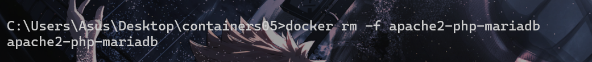


## Запускаем
```docker
docker run -d --name apache2-php-mariadb -p 80:80 apache2-php-mariadb
```
<button style = "padding:10px 20px;">запустить контейнер</button>

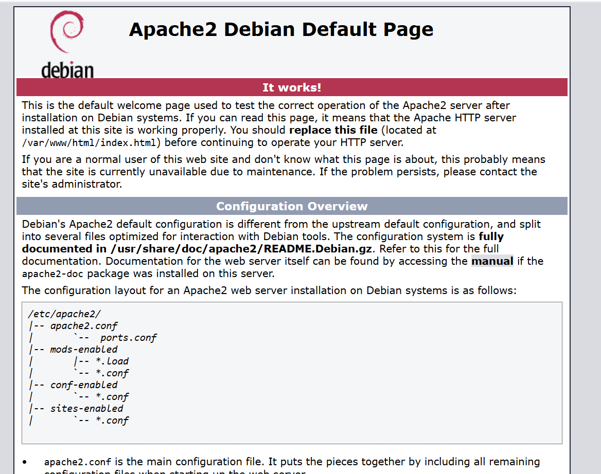

## треш
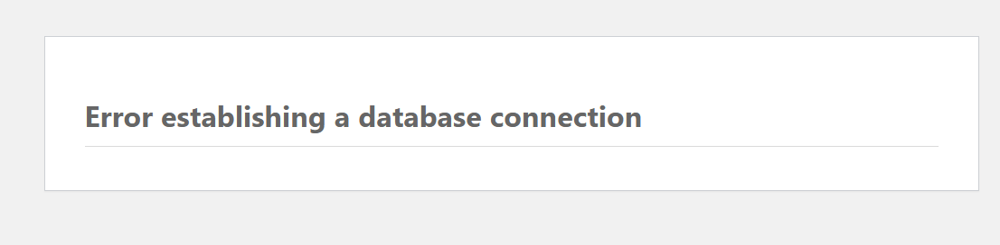

```php
define('DB_HOST', 'mariadb');
```
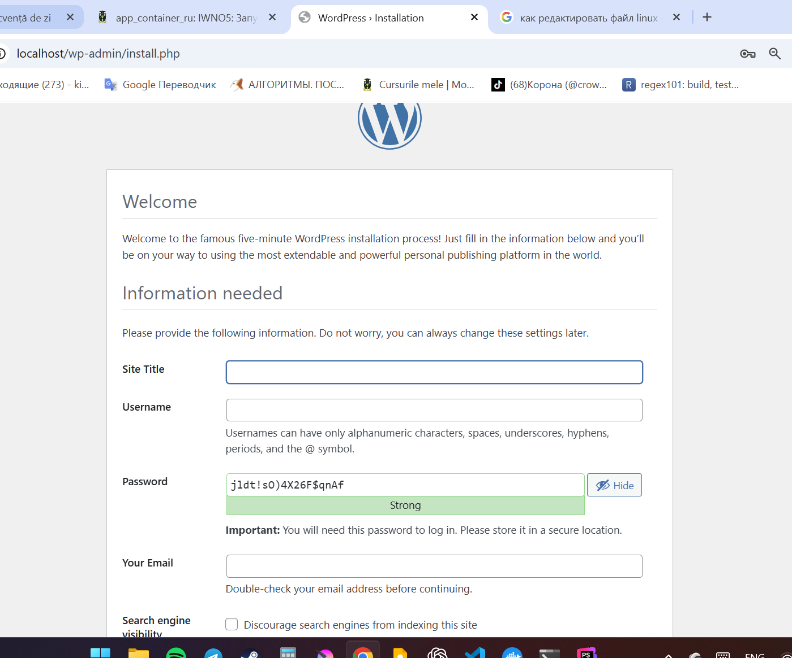

Я добавил и исправил следующие команды
```docker
# Устанавливаем рабочую директорию
WORKDIR /var/www/html

ADD https://wordpress.org/latest.tar.gz /var/www/html/
RUN tar -xzf latest.tar.gz --strip-components=1 \
    && rm latest.tar.gz
COPY files/wp-config.php /var/www/html/wp-config.php

```

а также заново создал базу данных, musql -u root, и все заработало!!!!

# Вывод
На этой лабораторной работе я запустил в одном контейнере сразу 3 приложения Apache2-php-mariadb, и настроил их, установив и сконфигурировав **wordpress** и другие файлы.
Я лучше научился работать с **Dockerfile** .Научился управлять контейнерами, монтировать тома и работать с базой данных внутри контейнера. .